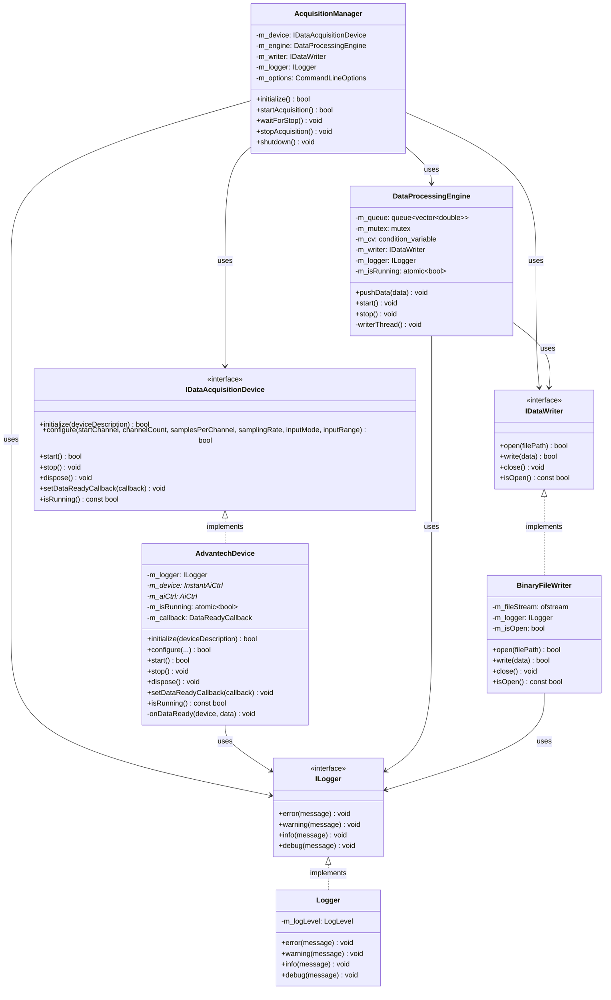
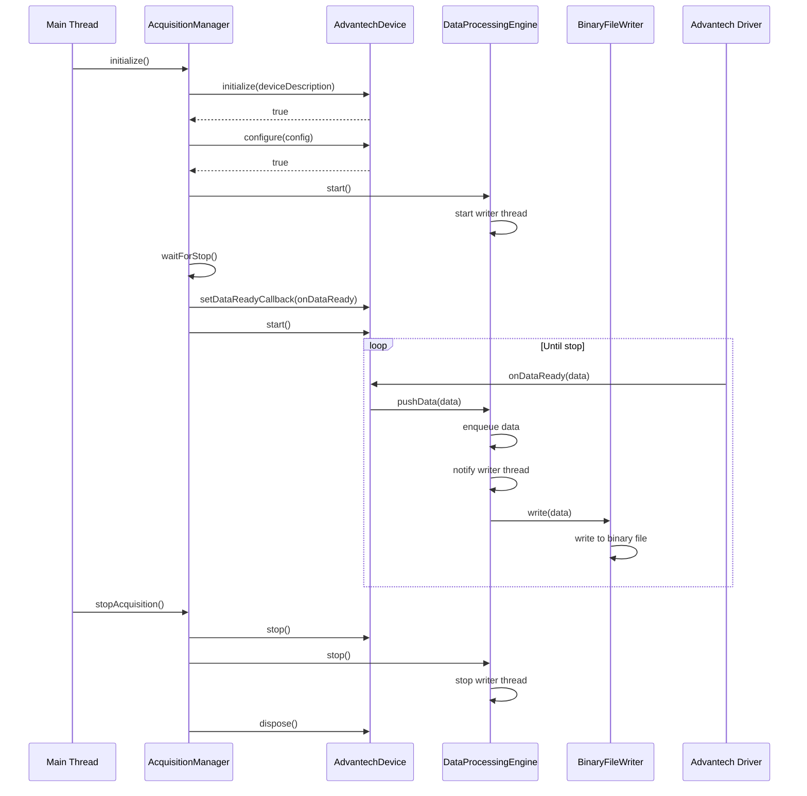
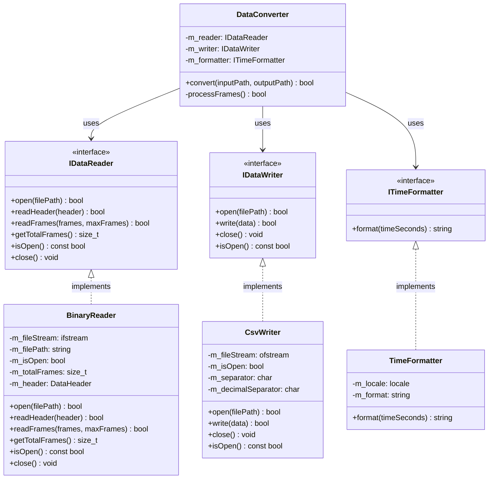
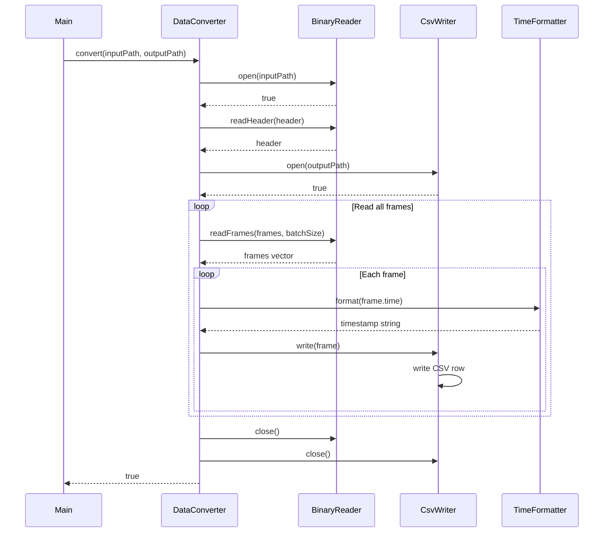

# PCI-1716 Data Acquisition System

C++ application suite for high-speed data acquisition using the Advantech PCI-1716 analog input card.

## Features

- **Real-time data acquisition** at up to 250 kHz sampling rate
- **Multi-channel support** (up to 16 channels)
- **Thread-safe architecture** with callback-based data handling
- **Binary data storage** for high-performance logging
- **CSV conversion** with timestamp generation
- **Windows-native** implementation using Advantech DAQNavi SDK

## System Requirements

- Windows operating system
- Advantech PCI-1716 analog input card
- Advantech DAQNavi SDK installed
- Visual Studio 2022 (or compatible MSVC compiler)
- CMake 3.20 or higher

## Quick Start

### Build the Project

Using the interactive build script:
```bash
build.bat
```

Or using CMake directly:
```bash
mkdir build
cd build
cmake .. -G "Visual Studio 17 2022" -A x64
cmake --build . --config Release
```

### Run Data Logger

Using the interactive launcher:
```bash
run.bat
```
Select option 1 and follow the prompts to configure acquisition parameters.

Or run directly:
```bash
data-logger.exe --device PCI-1716,BID#0 --start-channel 0 --end-channel 7 --rate 100000 --output daq_data.bin --input-mode unipolar --input-range 10V
```

### Convert Binary to CSV

Using the interactive launcher:
```bash
run.bat
```
Select option 2 and follow the prompts to convert binary files to CSV.

Or run directly:
```bash
data-converter.exe --input daq_data.bin --output daq_data.csv
```

### Interactive Launcher (`run.bat`)

The project now includes an interactive batch script that simplifies running both executables:

- **Menu-driven interface** with options for data-logger and data-converter
- **Interactive argument input** with default values and validation
- **Automatic console clearing** for improved user experience
- **Error handling** with clear feedback

Simply run `run.bat` from the project root and follow the on-screen prompts.

## Project Structure

```
pci-1716/
├── application/
│   ├── data-logger/      # Real-time acquisition application
│   │   ├── core/         # Core engine and interfaces
│   │   ├── devices/      # Device implementations (Advantech)
│   │   ├── logging/      # Logging infrastructure
│   │   ├── storage/      # Binary file storage
│   │   └── main/         # Application entry point
│   └── data-converter/   # Binary-to-CSV converter
│       ├── core/         # Conversion logic
│       ├── factory/      # Component factory
│       └── main/         # Application entry point
├── library/
│   └── DAQNavi/         # Advantech SDK wrapper
├── build/               # Build output directory
├── AGENTS.md            # AI agent instructions
├── CMakeLists.txt       # Root CMake configuration
└── build.bat            # Interactive build script
```

## Architecture Overview

### Data Logger

The data logger uses a multithreaded architecture:

1. **Main thread**: Initializes the device, handles configuration, and manages the acquisition lifecycle
2. **Callback thread**: Executes in the Advantech driver context, receives hardware interrupts, and pushes data to the queue
3. **Writer thread**: Reads from the queue and writes samples to a binary file

#### Class Diagram



#### Sequence Diagram (Data Acquisition)



### Data Converter

The converter reads binary files and generates CSV output with timestamps:

- Binary files store raw `double` samples with no headers
- Timestamps are computed from the sampling rate
- Output uses Russian locale (comma decimal separator)

#### Class Diagram



#### Sequence Diagram (Conversion Process)



### Component Interfaces

All code lives in the `app` namespace. Key interfaces:

- `IDataAcquisitionDevice`: Device abstraction
- `ILogger`: Logging infrastructure
- `DataReadyCallback`: Data reception callback
- `IDataReader` / `IDataWriter`: Converter interfaces
- `ITimeFormatter`: Timestamp generation

## Configuration

### Data Logger Command-Line Arguments

| Argument | Description | Default |
|----------|-------------|---------|
| `--device` | Device description (e.g., `PCI-1716,BID#0`) | `DemoDevice,BID#0` |
| `--start-channel` | First channel to acquire (0-15) | `0` |
| `--end-channel` | Last channel to acquire (0-15) | `15` |
| `--rate` | Sampling rate in Hz (max 250000) | `250000` |
| `--samples-per-channel` | Buffer size in samples per channel | `25000` |
| `--output` | Output binary file name | `daq_data.bin` |
| `--input-mode` | Input mode: `bipolar` or `unipolar` | `bipolar` |
| `--input-range` | Input range: `10V`, `5V`, `2.5V`, `1.25V` | `10V` |

### Data Converter Command-Line Arguments

| Argument | Description | Default |
|----------|-------------|---------|
| `--input-file` | Input binary file path | Required |
| `--output-file` | Output CSV file path | Required |
| `--help` | Show help message | — |
| `--version` | Show version information | — |

Example:
```bash
data-converter.exe --input daq_data.bin --output measurements.csv
```

> **Note:** The converter uses Russian locale by default. CSV uses semicolon (`;`) as field separator and comma (`,`) as decimal separator for proper Excel compatibility. Time format is `DD.MM.YYYY HH:MM:SS,mmm` with milliseconds separated by comma.

## Common Issues

1. **Device not found**: Verify Board ID in Advantech Navigator utility
2. **Data loss**: Increase buffer size: `aiCtrl->getBuffer()->setLength(1000000)`
3. **CSV decimal separators**: Uses comma by default (Russian locale). Remove locale for dot separator

## Development

### Build Configuration

- C++17 standard required
- MSVC static linking (`/MT` or `/MTd`)
- The `library::DAQNavi` target wraps the Advantech SDK

### Thread Safety

- Callback thread runs in high-priority Advantech context
- Writer thread owns the queue and handles disk I/O
- `std::atomic<bool>` prevents data races on `m_isRunning`
- Callbacks must not block; only push data to the queue

## License

This project is distributed under the MIT License. See the [LICENSE](LICENSE) file for details.

## 🤝 Contributing

For discussions, ideas, and suggestions, please create an [Issue](https://github.com/andredubov/advantech-data-logger/issues) or submit a [Pull Request](https://github.com/andredubov/advantech-data-logger/pulls).

---

For more detailed information, see [AGENTS.md](AGENTS.md) for AI agent instructions and build details.
